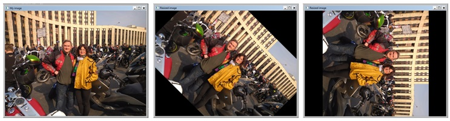

# postolit
Postoperative Library for Image Transformation (PostoLIT)

Developed: Prof. Anatoly Postolit 
(doctor of technical Sciences, Professor, academician of the Russian Academy of transport),
Director of the company Smart Information Systems LTd)
e-mail: anat_post@mail.ru

This function library is designed for post-processing images and frame-by-frame processing of video files. Can be used in computer vision systems (fixation of violations of traffic rules, assessment of drivers skills and car control, control of unmanned vehicles, counting the number of the visitor in the public areas and passengers in public transport, in medicine, in the advertising business, agriculture, etc.).
This is the first version of the library, which will be further developed and expanded.

Разработал: проф. Анатолий Постолит 
          (доктор технических наук, профессор, академик Российской академии транспорта),
          директор компании Smart Information Systems LTd)
 e-mail: anat_post@mail.ru

Данная библиотека функция предназначена для постобработки изображений и покадровой обработки видеофайлов. Может использоваться в системах компьютерного зрения (фиксация нарушений правил дорожного движения, оценка состояния водителей и мастерства управления автомобилем, управление беспилотными автомобилями, подсчет количества посетителе в публичных местах и пассажиров в общественном транспорте,  в медицине, в сфере рекламного бизнеса, в сельском хозяйстве и т.п.).
Это первая версия библиотеки, которая будет дорабатываться и расширяться.

Рис.1. Исходное изображение

Перечень базовых функций
        *-*-*-*-
1. Функция black_image(image)
------------------------------
Переводит изображение в черно-белое
- image – Исходное изображение
Возвращает измененное изображение

Рис.2. Трансформация исходного изображения в черно-белое

2.Функция canny_edge_detector(image)
Определяет границы (контуры) элементов изображения
- image – изображение
Возвращает измененное изображение в виде контурных линий

Рис.3. Определяет границы (контуры) элементов изображения

3.Функция get_video_param(file_input)
Получает параметры видеофайла, которые будут использованы для записи  аналогичного видео файла на диск с теми же параметрами (для файлов формата .mp4 и .avi)
- file_input – имя входного видео файла
Возвращает объект с параметрами, которые можно использовать для записи на диск другого файла (или этого же файла после его обработки). При этом сохраняется размер кадра по ширине и высоте.

4. Функция gray_image(image)
Переводит изображение в градации серого
- image – изображение
Возвращает измененное изображение

Рис.4. Трансформирует изображение в градации серого

5. Функция resize_height(image, height)
Изменяет высоту изображения до заданного размера
- image – изображение
- height – новая высота изображения
Возвращает измененное изображение

Рис.5. Изменение высоты изображения до заданного размера

6. Функция resize_percent (image, percent)
Уменьшает или увеличивает изображение на заданный процент. Если percent>100, то изображение увеличивается. Если percent<100, то изображение уменьшается.	image – изображение
- percent – процент масштабирования изображения
Возвращает измененное изображение

Рис.6. Уменьшение или увеличение изображения на заданный процент

7. Функция resize_width(image, width)
Изменяет ширину изображения до заданного размера
- image – изображение
- width – новая ширина изображения
Возвращает измененное изображение

Рис.7. Трансформирует изображение в градации серого

8. Функция resize_wh(image, width, height)
Изменяет ширину и высоту изображения до заданного размера
- image – изображение
- width – новая ширина изображения
- height – новая высота изображения
Возвращает измененное изображение

Рис.8. Изменениет ширины и высоты изображения до заданного размера

9. Функция rotate_image_fs(image, corner)
Вращение изображения на заданный угол с сохранением размера кадра (frame size). Если corner >0, то вращение по часовой стрелке. Если corner <0, то изображение повернется против часовой стрелки.
- image – изображение
- corner – угол поворота
Возвращает повернутое изображение с неизменным размером кадра

Рис.9. Вращение изображения на заданный угол с сохранением размера кадра

10. Функция rotate_image_is(mat, angle)
Вращение изображения на заданный угол с сохранением размера изображения (image size). Если corner >0, то вращение по часовой стрелке. Если corner <0, то изображение повернется против часовой стрелки.
- image – изображение
- corner – угол поворота
Возвращает повернутое изображение с неизменным размером и пропорциями изображения (с измененным размером кадра)

Рис.10. Вращение изображения на заданный угол с сохранением размера изображения

11. Функция set_video_param(file_input, width, height)
Задает параметры видеофайлу, которые будут использованы для изменения размера кадра и записи  обработанного видео файла на диск (для файлов формата .mp4 и .avi)
-file_input – имя входного видео файла
- width – ширина измененного кадра
- height - высота измененного кадра
Возвращает объект с параметрами, которые можно использовать для записи на диск файла с измененными размерами кадра.

Рис.11. Трансформирует видео в другой размер кадра

12. Функция segment_image(image)
Сегментирует изображение
- image – изображение
Возвращает изображение с выделение границ цветных областей

Рис.12. Сегментирует изображение

 
 
